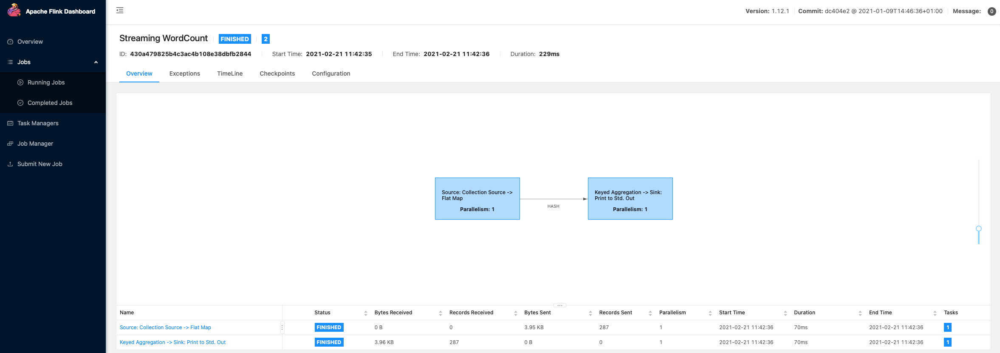

# Fast Data Cluster

## Content

In case you need a local cluster providing Kafka, Cassandra and Spark you're at the right place.

* [Apache Kafka 2.5.0](http://kafka.apache.org/25/documentation.html)
* [Apache Spark 2.4.5](http://spark.apache.org/releases/spark-release-2-4-5.html)
* [Apache Cassandra 3.11.6](http://cassandra.apache.org)
* [Apache Hadoop 3.2.1](https://hadoop.apache.org/docs/r3.2.1/)
* [Apache Flink 1.10.0](https://ci.apache.org/projects/flink/flink-docs-release-1.10)

## Prerequisites

* [Vagrant](https://www.vagrantup.com) (tested with 2.2.7)
* [VirtualBox](http://virtualbox.org) (tested with 6.1.6)
* [Ansible](http://docs.ansible.com/ansible/index.html) (tested with 2.9.7)
* The VMs take approx 18 GB of RAM, so you should have more than that.


:warning: Vagrant might ask you for your admin password. The reason behind is, that `vagrant-hostsupdater` is used to have the vms available with their names in your network.

## Init

```bash
git clone https://github.com/markush81/fastdata-cluster.git
vagrant up
```

## Cluster

The result if everything wents fine should be


## Coordinates

#### Servers

| IP | Hostname | Description | Settings |
|:--- |:-- |:-- |:-- |
|192.168.10.2|kafka-1|running a kafka broker| 1024 MB RAM |
|192.168.10.3|kafka-2|running a kafka broker| 1024 MB RAM |
|192.168.10.4|kafka-3|running a kafka broker| 1024 MB RAM |
|192.168.10.5|cassandra-1|running a cassandra node| 1024 MB RAM |
|192.168.10.6|cassandra-2|running a cassandra nodee| 1024 MB RAM |
|192.168.10.7|cassandra-3|running a cassandra node| 1024 MB RAM |
|192.168.10.8|hadoop-1|running a yarn resourcemanager and nodemanager, hdfs namenode, spark distribution, flink distribution| 4096 MB RAM |
|192.168.10.9|hadoop-2|running a yarn nodemanager, hdfs datanode | 4096 MB RAM |
|192.168.10.10|hadoop-3|running a yarn nodemanager, hdfs datanode | 4096 MB RAM |

### Connections

| Name |  |
|:-- |:-- |
|Zookeeper|kafka-1:2181,kafka-2:2181,kafka-3:2181|
|Kafka Brokers|kafka-1:9092,kafka-2:9092,kafka-3:9092|
|Cassandra Hosts|cassandra-1,cassandra-2,cassandra-3|
|YARN Resource Manager|[http://hadoop-1:8088](http://hadoop-1:8088)|
|HDFS Namenode UI|[http://hadoop-1:9870](http://hadoop-1:9870)|

# Usage


## Cassandra

```bash
lucky:~ markus$ vagrant ssh cassandra-1
[vagrant@cassandra-1 ~]$ cqlsh
Connected to analytics at 127.0.0.1:9042.
[cqlsh 5.0.1 | Cassandra 3.11.2 | CQL spec 3.4.4 | Native protocol v4]
Use HELP for help.
cqlsh>
```

Check Cluster Status:

```bash
[vagrant@cassandra-1 ~]$ nodetool status
Datacenter: dc1
===============
Status=Up/Down
|/ State=Normal/Leaving/Joining/Moving
--  Address        Load       Tokens       Owns (effective)  Host ID                               Rack
UN  192.168.10.8   92.34 KiB  256          69.1%             31f056d4-ffa4-4017-bbec-f07c8be4da3f  rack1
UN  192.168.10.9   89.38 KiB  256          68.9%             f54829f4-3f91-4913-98be-e46129852188  rack1
UN  192.168.10.10  82.36 KiB  256          62.0%             69ba4402-c1d5-450c-9b06-8e96ce3fe92f  rack1
```

## Zookeeper

```bash
[vagrant@kafka-1 ~]$ zookeeper-shell.sh kafka-1:2181/
Connecting to kafka-1:2181/
Welcome to ZooKeeper!
JLine support is disabled

WATCHER::

WatchedEvent state:SyncConnected type:None path:null
ls /
[admin, brokers, cluster, config, consumers, controller, controller_epoch, isr_change_notification, latest_producer_id_block, log_dir_event_notification, zookeeper]
ls /brokers/ids
[0, 1, 2]

```

## Kafka

### Topic Creation

```bash
lucky:~ markus$ vagrant ssh kafka-1
[vagrant@kafka-1 ~]$ kafka-topics.sh --create --zookeeper kafka-1:2181 --replication-factor 2 --partitions 6 --topic sample
Created topic "sample".
[vagrant@kafka-1 ~]$ kafka-topics.sh --zookeeper kafka-1 --topic sample --describe
Topic:sample	PartitionCount:6	ReplicationFactor:2	Configs:
	Topic: sample	Partition: 0	Leader: 1	Replicas: 1,2	Isr: 1,2
	Topic: sample	Partition: 1	Leader: 2	Replicas: 2,3	Isr: 2,3
	Topic: sample	Partition: 2	Leader: 3	Replicas: 3,1	Isr: 3,1
	Topic: sample	Partition: 3	Leader: 1	Replicas: 1,3	Isr: 1,3
	Topic: sample	Partition: 4	Leader: 2	Replicas: 2,1	Isr: 2,1
	Topic: sample	Partition: 5	Leader: 3	Replicas: 3,2	Isr: 3,2
[vagrant@kafka-1 ~]$
```
### Producer

```bash
[vagrant@kafka-1 ~]$ kafka-console-producer.sh --broker-list kafka-1:9092,kafka-3:9092 --topic sample
Hey, is Kafka up and running?
```

### Consumer

```bash
[vagrant@kafka-1 ~]$ kafka-console-consumer.sh --bootstrap-server kafka-1:9092,kafka-3:9092 --topic sample --from-beginning
Hey, is Kafka up and running?
```

## YARN

The YARN ResourceManager UI can be accessed by [http://hadoop-1:8088](http://hadoop-1:8088), from there you can navigate to your application .


## Spark

### Spark Examples

```bash
lucky:~ markus$ vagrant ssh hadoop-1
[vagrant@hadoop-1 ~]$ spark-submit --master yarn --class org.apache.spark.examples.SparkPi --deploy-mode cluster --driver-memory 512M --executor-memory 512M --num-executors 2 /usr/local/spark-2.4.5-bin-without-hadoop/examples/jars/spark-examples_2.11-2.4.5.jar 1000
```

## Flink

### Flink Examples

You can find Flink Web UI via YARN UI, e.g. http://hadoop-1:8088/proxy/application_1492940607011_0001/#/overview

Submit a job:

```bash
[vagrant@hadoop-1 ~]$ flink run /usr/local/flink-1.10.0/examples/streaming/WordCount.jar
```



## Further Links

- [yarn-default.xml](https://hadoop.apache.org/docs/r3.2.1/hadoop-yarn/hadoop-yarn-common/yarn-default.xml)
- [core-default.xml](https://hadoop.apache.org/docs/r3.2.1/hadoop-project-dist/hadoop-common/core-default.xml)
- [hdfs-default.xml](https://hadoop.apache.org/docs/r3.2.1/hadoop-project-dist/hadoop-hdfs/hdfs-default.xml)
- [Spark Documentation](https://spark.apache.org/docs/latest/)
- [Apache Cassandra Documentation](http://cassandra.apache.org/doc/latest/)
